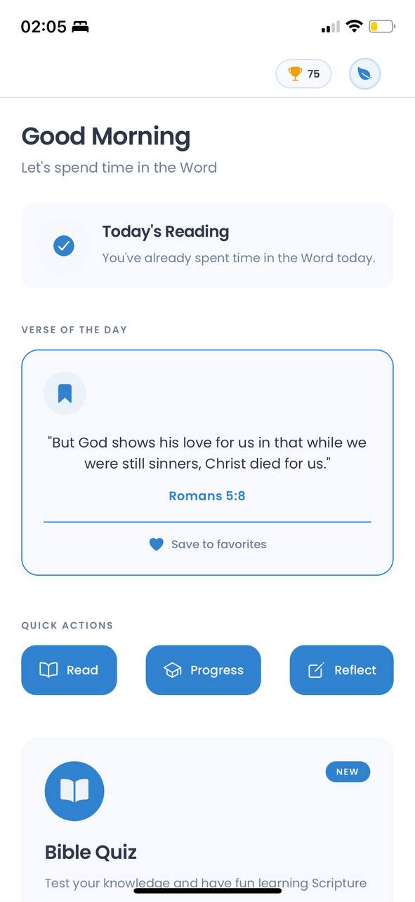
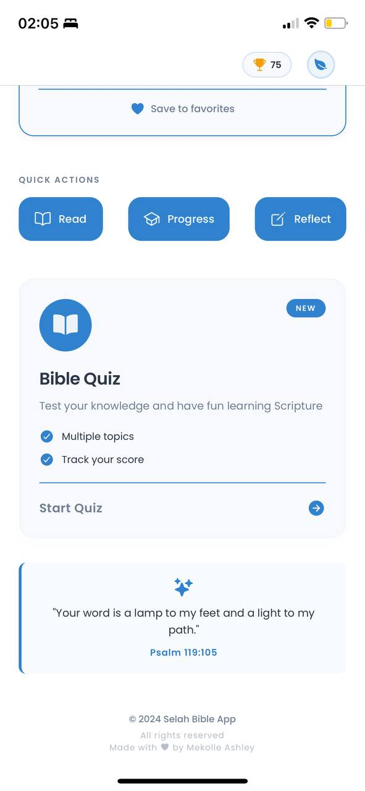

# Selah 🕊️ *(Tentative)*

> A Duolingo-inspired Bible learning and spiritual growth application focused on consistency, understanding, and habit formation.

---

## 📖 Overview

**Selah** *(tentative name)* is a Bible learning and study application designed to help Christians build a consistent habit of reading, understanding, and applying Scripture. Inspired by the gamified learning model of Duolingo, the app combines structured Bible reading plans, short lessons, quizzes, streaks, and progress tracking to encourage daily engagement with God’s Word.

This project is intentionally built incrementally to support daily development and continuous improvement.

---

## 🎯 Problem Statement

Many Christians struggle with:

* Consistency in Bible reading
* Knowing where to start or what to read next
* Retaining and understanding Scripture
* Maintaining motivation over time

Existing Bible apps often focus on content delivery rather than **habit formation and learning reinforcement**.

---

## 💡 Solution

Selah addresses these challenges by:

* Breaking Bible study into **small, daily, achievable tasks**
* Using **gamification** (streaks, XP, levels)
* Providing **guided learning paths** (reading, understanding, reflection)
* Tracking spiritual growth through measurable progress indicators

---

## ✨ Core Features (Planned)

* 📆 Daily Bible reading tasks
* 🔥 Reading streaks and consistency tracking
* 🧠 Short lessons and contextual explanations
* ❓ Quizzes and reflections to reinforce understanding
* 📊 Progress dashboard
* 🏆 Achievements and milestones
* 🔔 Reminders and nudges

---

## 🛠️ Tech Stack (Initial)

> Subject to evolution as the project grows

* **Frontend:** React 
* **Styling:** CSS / Tailwind (TBD)
* **Backend:** Firebase / Node.js (TBD)
* **Authentication:** Email / Social login (later phase)
* **Database:** Firestore / PostgreSQL (TBD)

---

## 🚧 Project Status

🟡 **Day 1 – Initialization**

This repository is in its early stages. Development will be done incrementally with **daily commits** to ensure steady progress and transparency.

---

## 🗺️ Roadmap (High-Level)

* Phase 1: Project setup & core reading flow
* Phase 2: Gamification (streaks, XP, progress)
* Phase 3: Learning content & quizzes
* Phase 4: User accounts & persistence
* Phase 5: Polish, accessibility & performance

---

## 🤝 Contribution

This project is currently a personal initiative. Contribution guidelines may be added in the future if the project is opened to the community.

---

## 🙏 Motivation

This app was born out of a personal desire to grow spiritually with consistency and intentionality—and to help others do the same.

> *“Your word is a lamp to my feet and a light to my path.”* — Psalm 119:105

---

## Selah Ui

Selah is coming out beautifully well :)

         

---

## 📌 Note on Naming

**Selah** is a **tentative name** and may change as the project evolves.
